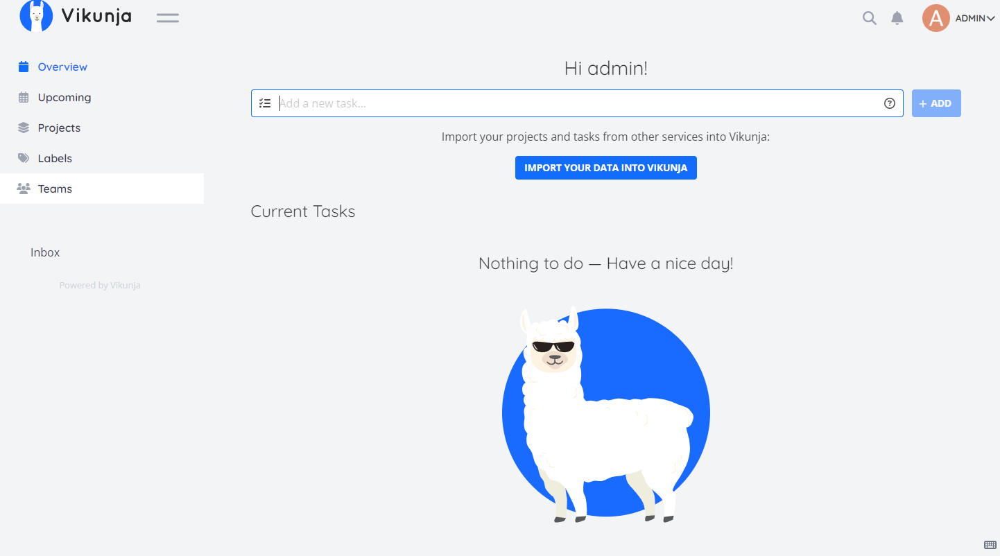

# Vikunja CI/CD pipeline

Deploy Vikunja server with CI/CD on Elestio

 
 

# Once deployed ...

You can open Vikunja UI here:

    URL: https://[CI_CD_DOMAIN]
    login: "admin"
    password: "[ADMIN_PASSWORD]"

You can open pgAdmin here:

    URL: https://[CI_CD_DOMAIN]:13841
    login: [ADMIN_EMAIL]
    password: [ADMIN_PASSWORD]
